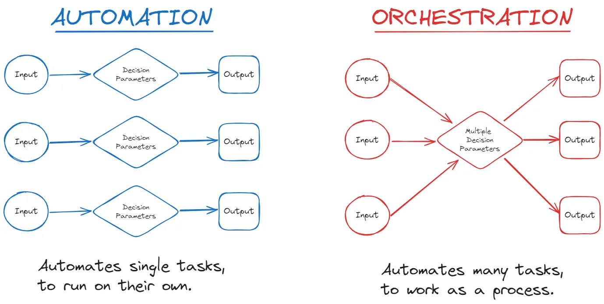
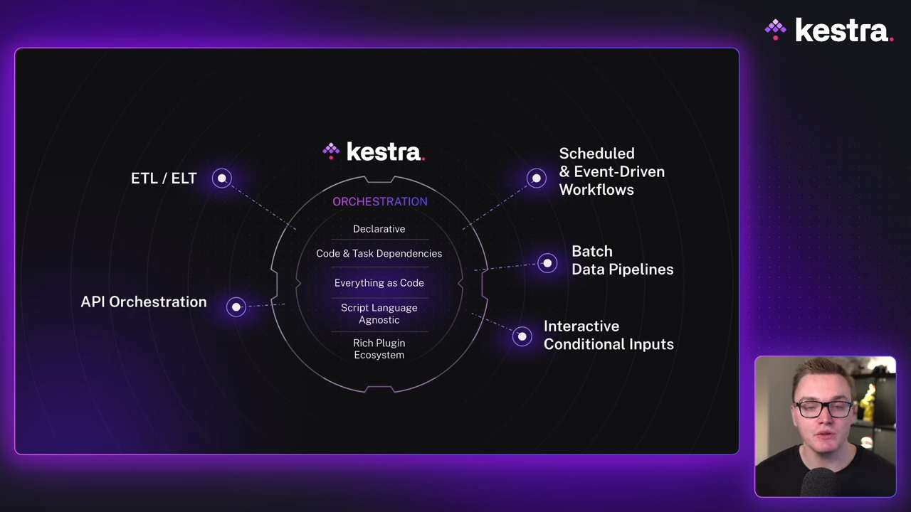

previous lessons: [Docker](../01_docker/README.md),  [Terraform](../01_3_terraform/README.md)


- [2.2.1 Introduction to Workflow Orchestration](#221-introduction-to-workflow-orchestration)
  - [So what is an orchestrator?](#so-what-is-an-orchestrator)
  - [What is Kestra?](#what-is-kestra)
    - [Start Kestra using Docker](#start-kestra-using-docker)
- [Hands-on coding project: Build data pipelines with Kestra](#hands-on-coding-project-build-data-pipelines-with-kestra)
  - [Setup Kestra with docker compose](#setup-kestra-with-docker-compose)
  - [Download the flows](#download-the-flows)
  - [Inspect the flows](#inspect-the-flows)
  - [Push the flows to Kestra](#push-the-flows-to-kestra)
  - [Test some flows](#test-some-flows)
    - [first flow (getting started)](#first-flow-getting-started)
    - [second flow (postgres taxi)](#second-flow-postgres-taxi)
    - [second flow scheduled (postgres taxi scheduled)](#second-flow-scheduled-postgres-taxi-scheduled)
    - [Using a dbt flow with Kestra](#using-a-dbt-flow-with-kestra)
  - [run ETL pipeline with Google Cloud Platform](#run-etl-pipeline-with-google-cloud-platform)
    - [Issue with gcp\_setup flow](#issue-with-gcp_setup-flow)
      - [Permission denied on storage.buckets.get](#permission-denied-on-storagebucketsget)
  - [run ETL pipeline with Google Cloud Platform](#run-etl-pipeline-with-google-cloud-platform-1)


## 2.2.1 Introduction to Workflow Orchestration

We will be using the open source orchestrator [Kestra](https://github.com/kestra-io/kestra) for this project.

### So what is an orchestrator?

> In software engineering and data management, an orchestrator is a tool that automates, manages, and coordinates various workflows and tasks across different services, systems, or applications.
> [Source](https://kestra.io/blogs/2024-09-18-what-is-an-orchestrator#what-is-an-orchestrator) 

In contrast to automation, where a single task is automated, orchestration involves coordinating and managing a series of tasks or workflows. 


[Source](https://kestra.io/blogs/2024-09-18-what-is-an-orchestrator#orchestration-vs-automation) 

There are different situations where orchestrators are used, for example when building an extract-transform-load (ETL) pipeline, setting up a CI/CD workflow or when deploying a cloud infrastructure (see [Source](https://kestra.io/blogs/2024-09-18-what-is-an-orchestrator#examples-of-orchestration)).

### What is Kestra?

Kestra is an [open source](https://github.com/kestra-io/kestra) [all-in-one](https://kestra.io/features) solution. 

[](https://youtu.be/Np6QmmcgLCs?t=100&si=bSID4Zb1etndf7sk)


There is quite a lot of documentation available on the [Kestra website](https://kestra.io/docs/), but [getting started](https://kestra.io/docs/getting-started/quickstart) is quite easy.

#### Start Kestra using Docker

```bash
docker run --pull=always --rm -it -p 8080:8080 --user=root -v /var/run/docker.sock:/var/run/docker.sock -v /tmp:/tmp kestra/kestra:latest server local
```

Open http://localhost:8080 in your browser to launch the UI. 

Now, we create a new flow by navigating to "Flows" using the menu on the left and clicking "Create" on the top right.

This opens a yaml editor prefilled with a simple example.

```yaml
id: myflow
namespace: company.team

tasks:
  - id: hello
    type: io.kestra.plugin.core.log.Log
    message: Hello World! 🚀
```

Here we already see some important variables **required** for every flow: `id`, `namespace` and `tasks`.

The `id` is a unique identifier for the flow. The `namespace` is a way to organize flows, potentially seperating development and production environments. The `tasks` is a list of tasks that will be executed in order.

Optionally, we can add a description, labels and other [properties](https://kestra.io/docs/workflow-components/flow) to the flow.

```yaml
id: getting_started
namespace: company.team

description: |
  # Getting Started
  Let's `write` some **markdown** - [first flow](https://t.ly/Vemr0) 🚀

labels:
  owner: rick.astley
  project: never-gonna-give-you-up

tasks:
  - id: hello_world
    type: io.kestra.plugin.core.log.Log
    message: Hello World!
    description: |
      ## About this task
      This task will print "Hello World!" to the logs.
```

We save the flow and run it by clicking the "Execute" button.

Wow, that was easy!

## Hands-on coding project: Build data pipelines with Kestra

Now we follow the [data engineering docs](https://github.com/DataTalksClub/data-engineering-zoomcamp/tree/main/02-workflow-orchestration#2-hands-on-coding-project-build-data-pipelines-with-kestra) to build data pipelines using Kestra.

### Setup Kestra with docker compose

We will use docker compose to spin up Kestra, a postgres database and the pgadmin tool. We will base that on the previously used [docker compose file docker introduction](../01_docker/docker-compose.yaml) and the [kestra instructions of installation via docker compose](https://kestra.io/docs/installation/docker-compose) (this [file](https://github.com/kestra-io/kestra/blob/develop/docker-compose.yml))

First we fetch the docker compose file and then we start the containers.

```bash
curl -o docker-compose.yml \
https://raw.githubusercontent.com/kestra-io/kestra/develop/docker-compose.yml
```

```bash
docker compose up -d
```

Open http://localhost:8080 in your browser to launch the UI.

### Download the flows 

We will save the flows in the `flows` directory.

```bash
mkdir flows
cd flows
```

```bash
wget -nc  https://raw.githubusercontent.com/DataTalksClub/data-engineering-zoomcamp/refs/heads/main/02-workflow-orchestration/flows/01_getting_started_data_pipeline.yaml
wget -nc  https://raw.githubusercontent.com/DataTalksClub/data-engineering-zoomcamp/refs/heads/main/02-workflow-orchestration/flows/02_postgres_taxi.yaml
wget -nc  https://raw.githubusercontent.com/DataTalksClub/data-engineering-zoomcamp/refs/heads/main/02-workflow-orchestration/flows/02_postgres_taxi_scheduled.yaml
wget -nc  https://raw.githubusercontent.com/DataTalksClub/data-engineering-zoomcamp/refs/heads/main/02-workflow-orchestration/flows/03_postgres_dbt.yaml
wget -nc  https://raw.githubusercontent.com/DataTalksClub/data-engineering-zoomcamp/refs/heads/main/02-workflow-orchestration/flows/04_gcp_kv.yaml
wget -nc  https://raw.githubusercontent.com/DataTalksClub/data-engineering-zoomcamp/refs/heads/main/02-workflow-orchestration/flows/05_gcp_setup.yaml
wget -nc  https://raw.githubusercontent.com/DataTalksClub/data-engineering-zoomcamp/refs/heads/main/02-workflow-orchestration/flows/06_gcp_taxi.yaml
wget -nc  https://raw.githubusercontent.com/DataTalksClub/data-engineering-zoomcamp/refs/heads/main/02-workflow-orchestration/flows/06_gcp_taxi_scheduled.yaml
wget -nc  https://raw.githubusercontent.com/DataTalksClub/data-engineering-zoomcamp/refs/heads/main/02-workflow-orchestration/flows/07_gcp_dbt.yaml
```

### Inspect the flows

When we open the [first flow](flows/01_getting_started_data_pipeline.yaml) in a text editor, we can see that the flows are written in yaml. There are a few interesting things to note here. 

1. In addition to the `id`, `namespace` and `tasks` variables, there is also a `inputs` variable. This is a way to pass variables to the flow and can be adjusted before execution.
2. We can use string interpolation to use variables in the flow. The `{{object.var_name}}` syntax is used to do this.
3. We can refer to the Kestra workspace using the `{{workingDir}}` variabble.

We can learn more about workflow components in the [Kestra documentation](https://kestra.io/docs/workflow-components).

### Push the flows to Kestra

We can copy the flows to the Kestra server using the API.

```bash
for flow in $(ls *.yaml); do
curl -X POST http://localhost:8080/api/v1/flows/import -F fileUpload=@$flow
done
```

Then we can see the flows in the UI at http://localhost:8080/ui/flows?scope=USER. 

### Test some flows

#### first flow (getting started)

We can select the [first flow](http://localhost:8080/ui/flows/edit/zoomcamp/01_getting_started_data_pipeline) and click "Execute" to run it. 

It should work out of the box.

#### second flow (postgres taxi)

Now lets try the [second flow](http://localhost:8080/ui/flows/edit/zoomcamp/02_postgres_taxi) and click "Execute".

This flow will fail, so we check the logs. 

It says:

```
2025-02-02 17:24:29.326org.postgresql.util.PSQLException: Connection to host.docker.internal:5432 refused. Check that the hostname and port are correct and that the postmaster is accepting TCP/IP connections.
2025-02-02 17:24:29.326Connection to host.docker.internal:5432 refused. Check that the hostname and port are correct and that the postmaster is accepting TCP/IP connections.
 Connection refused
```

Seems like the correct postgres database is not running. The reason is that we have not started the postgres container.
This was described in the [video lesson](https://www.youtube.com/watch?v=OkfLX28Ecjg&list=PL3MmuxUbc_hJed7dXYoJw8DoCuVHhGEQb&index=20&t=346s) and there is actually a [separate docker compose](https://github.com/DataTalksClub/data-engineering-zoomcamp/blob/main/02-workflow-orchestration/postgres/docker-compose.yml) file for creating this postgres database.

We create a new folder `postgres` and copy the docker compose file from the [data engineering repo](https://github.com/DataTalksClub/data-engineering-zoomcamp/blob/main/02-workflow-orchestration/postgres/docker-compose.yml) into it.


```bash
## move to base directory
cd ..
mkdir postgres
wget -nc https://raw.githubusercontent.com/DataTalksClub/data-engineering-zoomcamp/refs/heads/main/02-workflow-orchestration/postgres/docker-compose.yml -O postgres/docker-compose.yml
```

Now we can start the postgres database

```bash
docker compose -f postgres/docker-compose.yml up -d
```

Now we try again the flow. It should work.

> NOTE: Somehow this time there is no `postgres-data` folder created in the local directory, even though we mounted the folder in the docker compose file. This happens because we are using a [docker volume](https://docs.docker.com/engine/storage/volumes/), a persistent storage managed by docker.

We would like to explore the data in the database. We can add pgadmin to the postgres docker compose file as done [before](../01_docker/docker-compose.yaml). 
We can store the configuration in a separate volume to avoid losing the configuration when we restart the container. And we have to adjust the ports to avoid conflicts with the Kestra container.

```
version: "3.8"
services:
  postgres:
    image: postgres
    container_name: postgres-db
    environment:
      POSTGRES_USER: kestra
      POSTGRES_PASSWORD: k3str4
      POSTGRES_DB: postgres-zoomcamp
    ports:
      - "5432:5432"
    volumes:
      - postgres-data:/var/lib/postgresql/data

  pgadmin:
    image: dpage/pgadmin4
    environment:
      - PGADMIN_DEFAULT_EMAIL=admin@admin.com
      - PGADMIN_DEFAULT_PASSWORD=root
      - PGADMIN_DEFAULT_DB=postgres-zoomcamp
    volumes:
      - pgadmin-config:/var/lib/pgadmin
    ports:
      - "8085:80"

volumes:
  postgres-data:
  pgadmin-config:
```

We can now restart the postgres database and pgadmin.

```bash
docker compose -f postgres/docker-compose.yml down
docker compose -f postgres/docker-compose.yml up -d
```


> NOTE: There is a valuable SQL command to empty an existing table without deleting it: `TRUNCATE TABLE table_name;`. 


Now this works and we can see the data in the pgadmin tool.

#### second flow scheduled (postgres taxi scheduled)

We can execute the [scheduled second flow](http://localhost:8080/ui/flows/edit/zoomcamp/02_postgres_taxi_scheduled) and see the logs.

When trying to execute the [backfill](https://youtu.be/_-li_z97zog?t=97&si=KZFqLYMivpCyK680), I get a "page not found" error. 

There was a note in the data engineering repo that mentioned to use a version of postgres above 15, so I checked the current postgres version. It was version 13.

So I removed all running containers with: 

```bash
docker compose down
docker compose -f postgres/docker-compose down
```

And I requested the latest postgres version in the [database compose file](postgres/docker-compose.yml). 

Then spin the containers up again.

```bash
docker compose up -d
docker compose -f postgres/docker-compose up -d
```

When trying to execute the backfill again for the green taxi dataset of 2019, now everything works.

#### Using a dbt flow with Kestra

[dbt](https://github.com/dbt-labs/dbt-core) is a tool for transforming data in databases. It is a popular tool for data engineering.

After running the [postgres_dbt flow](http://localhost:8080/ui/flows/edit/zoomcamp/03_postgres_dbt/editor), we will get more summary tables in our database. 

### run ETL pipeline with Google Cloud Platform

The gcp flows require a bit more setup than the previous ones. We are using the [key-value store](https://kestra.io/docs/concepts/kv-store) to store the credentials. We can get to it via the UI: "Namespaces" -> "zoomcamp" -> "KV store".

To fill our key-value store, we need to get some information from the [Google Cloud Platform](https://console.cloud.google.com/).

#### Issue with gcp_setup flow

##### Permission denied on storage.buckets.get

When running the [gcp_setup flow](http://localhost:8080/ui/flows/edit/zoomcamp/05_gcp_setup), I get the following error:


```bash
2025-02-03 08:12:17.991create_gcs_bucket2i78v7qCFw9Q7rKzR424iM
zoomcamp@kestra-sandbox-449806.iam.gserviceaccount.com does not have storage.buckets.get access to the Google Cloud Storage bucket. Permission 'storage.buckets.get' denied on resource (or it may not exist).
2025-02-03 08:12:17.991create_gcs_bucket2i78v7qCFw9Q7rKzR424iM
403 Forbidden
 GET https://storage.googleapis.com/storage/v1/b/kestra-de-zoomcamp-bucket?projection=full
 {
 "code" : 403,
 "errors" : [ {
 "domain" : "global",
 "message" : "zoomcamp@kestra-sandbox-449806.iam.gserviceaccount.com does not have storage.buckets.get access to the Google Cloud Storage bucket. Permission 'storage.buckets.get' denied on resource (or it may not exist).",
 "reason" : "forbidden"
 } ],
 "message" : "zoomcamp@kestra-sandbox-449806.iam.gserviceaccount.com does not have storage.buckets.get access to the Google Cloud Storage bucket. Permission 'storage.buckets.get' denied on resource (or it may not exist)."
 }
```

I tried manually creating the bucket in the GCP console, but this showed me that the bucket already existed.
So I came up with another name for the bucket and it worked.


Next I reran the setup flow and it worked until the `create_bq_dataset` task, where I got the following error:

```bash
2025-02-03 08:44:12.162Invalid dataset ID "de-zoomcamp". Dataset IDs must be alphanumeric (plus underscores) and must be at most 1024 characters long.
2025-02-03 08:44:12.162400 Bad Request
 POST https://bigquery.googleapis.com/bigquery/v2/projects/kestra-sandbox-449806/datasets?prettyPrint=false
 {
 "code": 400,
 "errors": [
 {
 "domain": "global",
 "message": "Invalid dataset ID \"de-zoomcamp\". Dataset IDs must be alphanumeric (plus underscores) and must be at most 1024 characters long.",
 "reason": "invalid"
 }
 ],
 "message": "Invalid dataset ID \"de-zoomcamp\". Dataset IDs must be alphanumeric (plus underscores) and must be at most 1024 characters long.",
 "status": "INVALID_ARGUMENT"
```

A quick chat with chatGPT gave me the hint to not use a dash in the dataset name, so I changed the dataset name to `de_zoomcamp` and it worked.

After fixing this issue, I was able to run the `gcp_setup`.

### run ETL pipeline with Google Cloud Platform

Subsequently, we can run the [06_gcp_taxi flow](http://localhost:8080/ui/flows/edit/zoomcamp/06_gcp_taxi). After it is finished, we can go to our [bucket](https://console.cloud.google.com/storage/browser/kestra-de-zoomcamp-bucket-123456;tab=objects?inv=1&invt=AbokZQ&project=kestra-sandbox-449806&supportedpurview=project&prefix=&forceOnObjectsSortingFiltering=false) and see the downloaded data. We can see in the [BigQuery UI](https://console.cloud.google.com/bigquery?inv=1&invt=AbokZQ&project=kestra-sandbox-449806&supportedpurview=project&ws=!1m5!1m4!4m3!1skestra-sandbox-449806!2sde_zoomcamp!3sgreen_tripdata!1m15!1m4!1m3!1skestra-sandbox-449806!2sbquxjob_2d7585e_194cb263787!3seurope-west2!1m4!4m3!1skestra-sandbox-449806!2sde_zoomcamp!3syellow_tripdata!1m4!1m3!1skestra-sandbox-449806!2sbquxjob_48b084dd_194cb329aa4!3seurope-west2) that tables have been created. Now we can run SQL queries on the data directly in BigQuery.
