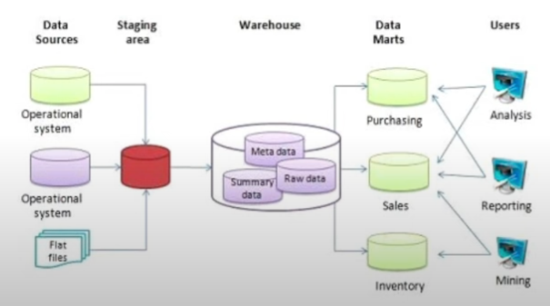
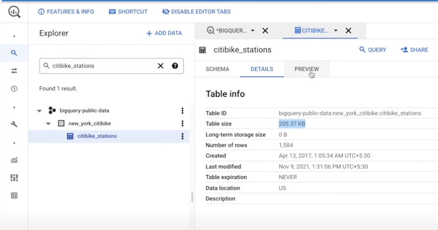
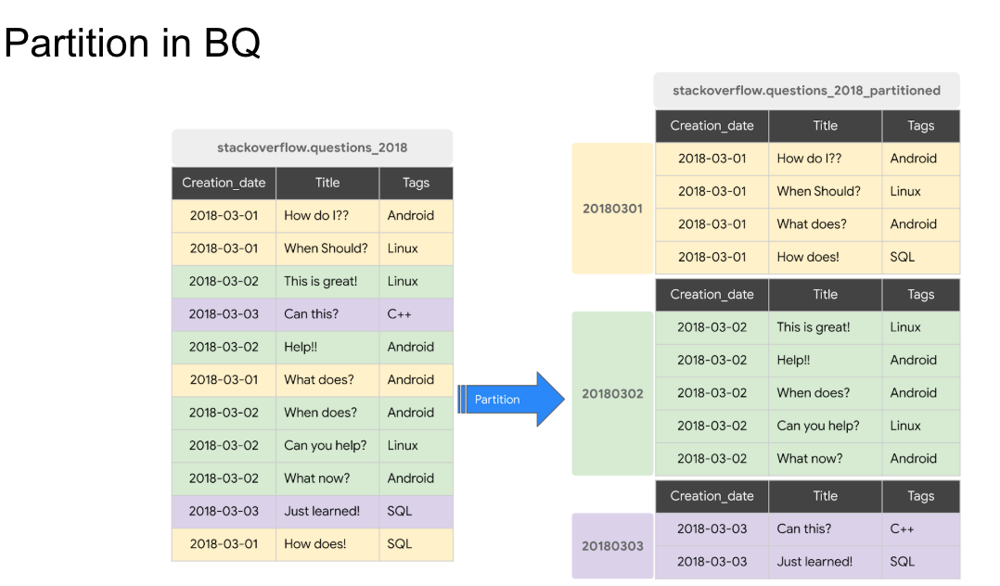
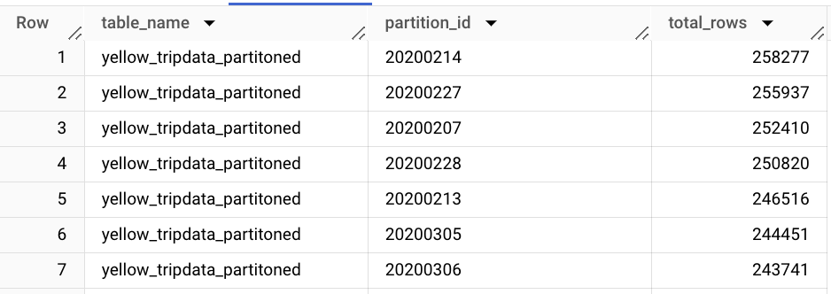
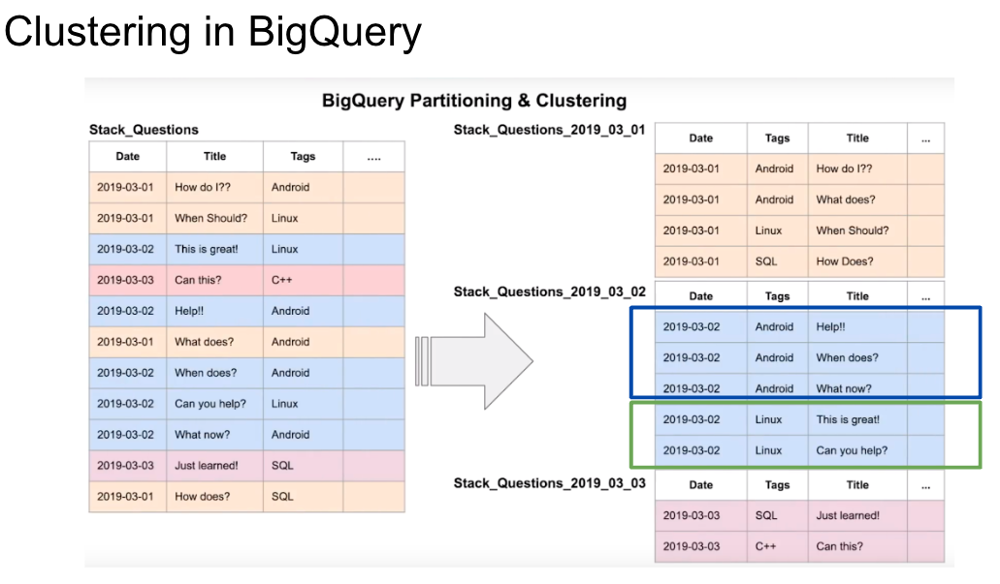
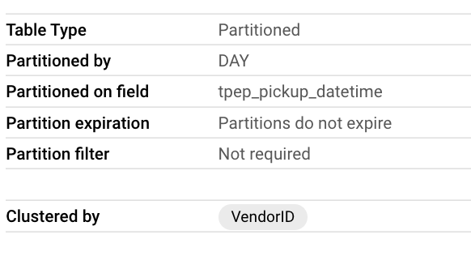
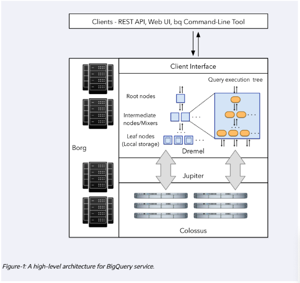
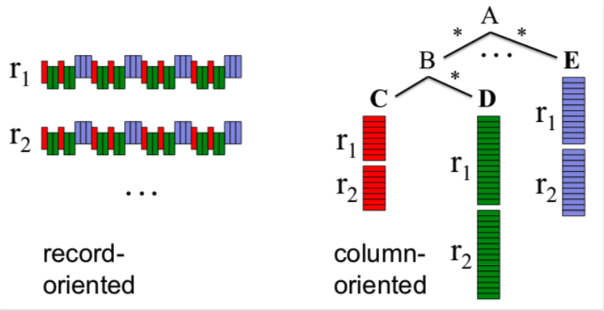
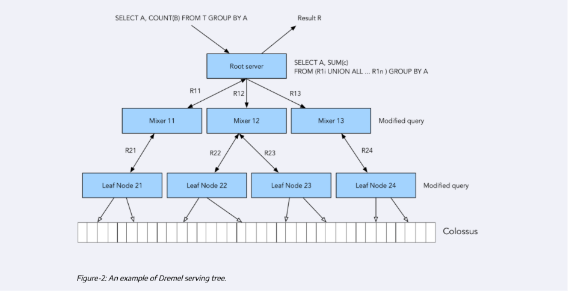

- [3.1.1 Data Warehouse and BigQuery](#311-data-warehouse-and-bigquery)
  - [OLAP vs OLTOP](#olap-vs-oltop)
  - [Data Warehouse](#data-warehouse)
  - [BigQuery](#bigquery)
    - [BigQuery Cost](#bigquery-cost)
    - [External Tables](#external-tables)
- [3.1.2 Partitioning and Clustering](#312-partitioning-and-clustering)
  - [Partitioning](#partitioning)
  - [Clustering](#clustering)
  - [Using Clustering over Partitioning](#using-clustering-over-partitioning)
  - [Automatic ReClustering](#automatic-reclustering)
- [BiqQuery Best Practices](#biqquery-best-practices)
  - [Cost Reduction](#cost-reduction)
  - [Query performance](#query-performance)
- [Biquery Internals](#biquery-internals)
  - [Architecture](#architecture)
  - [Column vs Record-oriented storage](#column-vs-record-oriented-storage)
  - [Dremel](#dremel)
  - [Recommended Reading](#recommended-reading)
- [Machine Learning with BigQuery](#machine-learning-with-bigquery)

## 3.1.1 Data Warehouse and BigQuery

[Slides](https://docs.google.com/presentation/d/1a3ZoBAXFk8-EhUsd7rAZd-5p_HpltkzSeujjRGB2TAI/edit#slide=id.p)

### OLAP vs OLTOP

- OLAP: Online Analytical Processing
- OLTP: Online Transaction Processing

   
|                     | OLTP                                                                                              | OLAP                                                                              |
| ------------------- | ------------------------------------------------------------------------------------------------- | --------------------------------------------------------------------------------- |
| Purpose             | Control and run essential business operations in real time                                        | Plan, solve problems, support decisions, discover hidden insights                 |
| Data updates        | Short, fast updates initiated by user                                                             | Data periodically refreshed with scheduled, long-running batch jobs               |
| Database design     | Normalized databases for efficiency                                                               | Denormalized databases for analysis                                               |
| Space requirements  | Generally small if historical data is archived                                                    | Generally large due to aggregating large datasets                                 |
| Backup and recovery | Regular backups required to ensure business continuity and meet legal and governance requirements | Lost data can be reloaded from OLTP database as needed in lieu of regular backups |
| Productivity        | Increases productivity of end users                                                               | Increases productivity of business managers, data analysts, and executives        |
| Data view           | Lists day-to-day business transactions                                                            | Multi-dimensional view of enterprise data                                         |
| User examples       | Customer-facing personnel, clerks, online shoppers                                                | Knowledge workers such as data analysts, business analysts, and executives        |


### Data Warehouse

A data warehouse is an OLAP solution used for reporting and data analysis.



### BigQuery

Bigquery includes multiple public datasets, that can be found via the Exporer UI.


```sql
-- Query public available table
SELECT station_id, name FROM
    bigquery-public-data.new_york_citibike.citibike_stations
LIMIT 100;
```



#### BigQuery Cost


- On demand pricing model: 
  - 1 TB of data processed is $5
- Flat rate pricing model: 
  - Based on number of pre requested slots
  - 100 slots → $2,000/month = 400 TB data processed on demand pricing


#### External Tables

BiqQuery can query data from external sources, such as csv files stored in Google Cloud Storage.

> NOTE: The size of external tables can not be seen in the UI. 


## 3.1.2 Partitioning and Clustering


### Partitioning
Partition allows to group data by a column. This allows to reduce the cost, as we only need to scan the data that we are interested in.



This is useful if we want to query a specific subset of the data, like specific dates.

We can use the nyc taxi dataset to demonstrate this. This dataset is already stored in GCS, thus we can create a table from it.

```sql
-- Creating external table referring to gcs path
CREATE OR REPLACE EXTERNAL TABLE `de_zoomcamp.external_yellow_tripdata`
OPTIONS (
  format = 'CSV',
  uris = ['gs://kestra-de-zoomcamp-bucket-123456/yellow_tripdata_2020-*.csv', 'gs://kestra-de-zoomcamp-bucket-123456/yellow_tripdata_2021-*.csv']
);

-- Check yello trip data
SELECT * FROM de_zoomcamp.external_yellow_tripdata limit 10;
```

For the direct comparison, we can create a non-partitioned table and a partitioned table.


```sql
-- Create a non partitioned table from external table
CREATE OR REPLACE TABLE de_zoomcamp.yellow_tripdata_non_partitoned AS
SELECT * FROM de_zoomcamp.external_yellow_tripdata;


-- Create a partitioned table from external table
CREATE OR REPLACE TABLE de_zoomcamp.yellow_tripdata_partitoned
PARTITION BY
  DATE(tpep_pickup_datetime) AS
SELECT * FROM de_zoomcamp.external_yellow_tripdata;

-- Impact of partition
-- Scanning ~600 MB of data
SELECT DISTINCT(VendorID)
FROM de_zoomcamp.yellow_tripdata_non_partitoned
WHERE DATE(tpep_pickup_datetime) BETWEEN '2020-06-01' AND '2020-06-30';

-- Scanning ~8 MB of DATA
SELECT DISTINCT(VendorID)
FROM de_zoomcamp.yellow_tripdata_partitoned
WHERE DATE(tpep_pickup_datetime) BETWEEN '2020-06-01' AND '2020-06-30';

-- Let's look into the partitons
SELECT table_name, partition_id, total_rows
FROM `de_zoomcamp.INFORMATION_SCHEMA.PARTITIONS`
WHERE table_name = 'yellow_tripdata_partitoned'
ORDER BY total_rows DESC;
```



In Summary, partition by Time-unit columns makes sense if you capture data in a time-series. You can use the following partitioning strategy:
Ingestion time (_PARTITIONTIME) and Integer range partitioning.
When using Time unit or ingestion time, the default is to use a daily granularity, but depending on the use case, you can use other time units, such as hourly, monthly, or yearly. The number of partitions is limited to 4000. 


### Clustering

Clustering allows to group data by a column. This allows to group data within a partition. This allows to reduce the cost, but also to improve the performance.



As an example, we can partition our data by pickup date and cluster by vendor id.

```sql
-- Creating a partition and cluster table
CREATE OR REPLACE TABLE de_zoomcamp.yellow_tripdata_partitoned_clustered
PARTITION BY DATE(tpep_pickup_datetime)
CLUSTER BY VendorID AS
SELECT * FROM de_zoomcamp.external_yellow_tripdata;
```

This can be seen in the details of the table.


We see a difference in the cost of the query, as the clustered table bills less.

```sql
-- Query scans 345.52 MB, and bills 345.52 MB
SELECT count(*) as trips
FROM de_zoomcamp.yellow_tripdata_partitoned
WHERE DATE(tpep_pickup_datetime) BETWEEN '2020-06-01' AND '2021-12-31'
  AND VendorID=1;

-- Query scans 345.52 MB, but bills 325.23 MB
SELECT count(*) as trips
FROM de_zoomcamp.yellow_tripdata_partitoned_clustered
WHERE DATE(tpep_pickup_datetime) BETWEEN '2020-06-01' AND '2021-12-31'
  AND VendorID=1;
```


In Summary, clustering by columns makes sense if you want to group data within a partition. The columns you specify are used to colocate related data, thus the order of the column is important. The order of the specified columns determines the sort order of the data. Clustering improves the performance of Filter and Aggregate queries. 
Table with data size < 1 GB, don’t show significant improvement with partitioning and clustering, they may even increase the cost due to the overhead of maintaining the metadata of the table.
You can specify up to four clustering columns. 


| **Clustering**                                                                       | **Partitioning**                     |
| ------------------------------------------------------------------------------------ | ------------------------------------ |
| Cost benefit unknown                                                                 | Cost known upfront                   |
| You need more granularity than partitioning alone allows                             | You need partition-level management. |
| Your queries commonly use filters or aggregation against multiple particular columns | Filter or aggregate on single column |
| The cardinality of the number of values in a column or group of columns is large     |                                      |


 

### Using Clustering over Partitioning

Use clustering over partitioning if:
- Partitioning results in small data per partition (~ <1GB)
- Partitioning results in a large number of partitions (>4000)
- Frequent mutations affect most partitions

### Automatic ReClustering

BigQuery automatically re-clusters data in the background to maintain the sort property of the table. This is especially important for partitioned tables, where clustering is maintained within each partition.


## BiqQuery Best Practices

### Cost Reduction


- Avoid SELECT *:
    - Specify the columns that you need in the SELECT clause instead of using SELECT *.
    - This way if only a few columns are needed, BiqQuery will not have to scan the whole table.
- Price your queries before running them:
    - Check the cost of your query using the top-right UI field.
- Use clustered or partitioned tables:
    - Use clustering over partitioning if:
        - Partitioning results in small data per partition (~ <1GB)
        - Partitioning results in a large number of partitions (>4000)
        - Frequent mutations affect most partitions
    - Partitioning results in known cost upfront.
    - You need partition-level management.
    - Filter or aggregate on single column.
- Use streaming inserts with caution:
    - Streaming inserts can result in high cost.
    - It is better to batch inserts.
- Materialize query results in stages:
    - Materialize intermediate results in stages.
    - This way you can reuse intermediate results instead of re-running them.


### Query performance

- Filter on partitioned columns
  - BigQuery can prune partitions before executing the query, saving on computation time and costs.
- Denormalizing data
- Use nested or repeated columns
- Use external data sources appropriately
  - External data sources can lead to additional costs.
- Don't use it, in case u want a high query performance
  - External data sources are not as performant as data stored in BigQuery.
- Reduce data before using a JOIN
- Do not treat WITH clauses as prepared statements:
    - WITH clauses are not the same as prepared statements.
    - Prepared statements are pre-parsed SQL statements that can be executed multiple times with different parameters.
    - WITH clauses are used to define a temporary named result set, known as a Common Table Expression (CTE).
- Avoid oversharding tables
    - Oversharding is a technique used to horizontally split a table into multiple tables to decrease the cost of a query.
    - However if the table is sharded too much, it can lead to increased costs.


- Avoid JavaScript user-defined functions:
- Use approximate aggregation functions (HyperLogLog++):
- Order Last, for query operations to maximize performance:
- Optimize your join patterns:
    - As a best practice, place the table with the largest number of rows first, followed by the table with the fewest rows, and then place the remaining tables by decreasing size:
    - This will lead to evenly distributed rows of the first table, while the following tables will be broadcasted the all the nodes.


## Biquery Internals

###  Architecture


Source: https://docs.google.com/presentation/d/1a3ZoBAXFk8-EhUsd7rAZd-5p_HpltkzSeujjRGB2TAI/edit#slide=id.g10eebc44ce4_0_83

| Component | Description                                                                    |
| --------- | ------------------------------------------------------------------------------ |
| Colossus  | Cheap storage in columnar format                                               |
| Borg      | Computing cluster in BiqQuery datacenter, providing high large number of cores |
| Jupiter   | Network connection in BiqQuery datacenter, providing high bandwidth ( 1TB/s)   |
| Dremel    | Query execution engine in BiqQuery datacenter                                  |

Source: https://cloud.google.com/blog/products/bigquery/bigquery-under-the-hood?hl=en


### Column vs Record-oriented storage



Record-oriented storage is similar to a row-oriented database, or data stored in a CSV file.

Column-oriented storage is similar to a columnar database, or data stored in a Parquet file.


### Dremel




### Recommended Reading

- https://cloud.google.com/bigquery/docs/how-to
- https://research.google/pubs/pub36632/
- https://panoply.io/data-warehouse-guide/bigquery-architecture/
- http://www.goldsborough.me/distributed-systems/2019/05/18/21-09-00-a_look_at_dremel/


## Machine Learning with BigQuery

[Video](https://www.youtube.com/watch?v=B-WtpB0PuG4&list=PL3MmuxUbc_hJed7dXYoJw8DoCuVHhGEQb&index=31)


