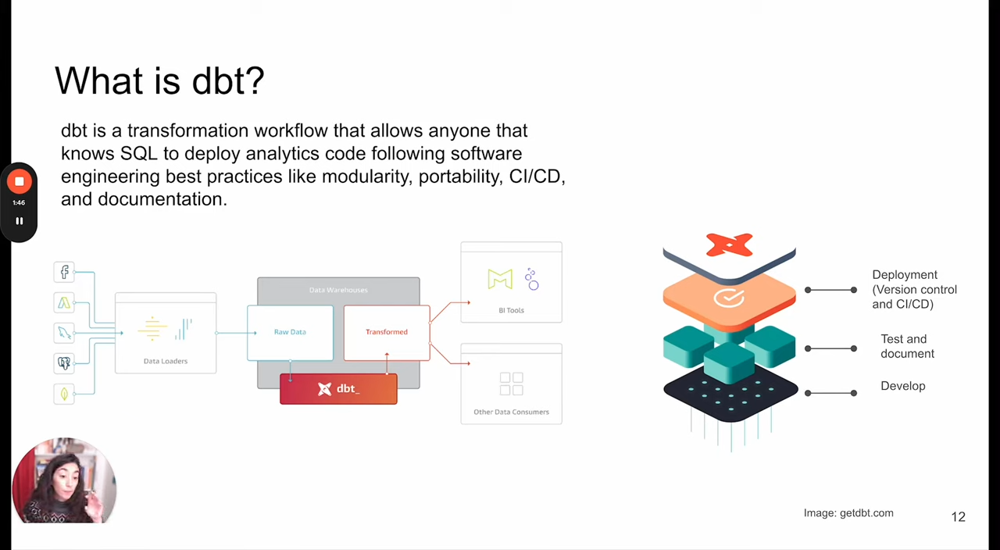

# Analytics Engineering

[Video](https://www.youtube.com/watch?v=uF76d5EmdtU&list=PL3MmuxUbc_hJed7dXYoJw8DoCuVHhGEQb&index=33) | [DE-Zoomcamp Notes](https://github.com/DataTalksClub/data-engineering-zoomcamp/tree/main/04-analytics-engineering)

- [Analytics Engineering](#analytics-engineering)
  - [What is a Analytics Engineering?](#what-is-a-analytics-engineering)
  - [Tooling in Data Processing](#tooling-in-data-processing)
  - [ETL vs ELT](#etl-vs-elt)
    - [**ETL (Extract → Transform → Load)**](#etl-extract--transform--load)
    - [**ELT (Extract → Load → Transform)**](#elt-extract--load--transform)
  - [Kimball’s Dimensional Modeling](#kimballs-dimensional-modeling)
    - [**Objective**](#objective)
    - [**Approach**](#approach)
    - [**Other Approaches**](#other-approaches)
  - [Elements of Dimensional Modeling](#elements-of-dimensional-modeling)
    - [**Fact Tables**](#fact-tables)
    - [**Dimension Tables**](#dimension-tables)
  - [Architecture of Dimensional Modeling](#architecture-of-dimensional-modeling)
    - [**Stage Area**](#stage-area)
    - [**Processing Area**](#processing-area)
    - [**Presentation Area**](#presentation-area)
  - [What is dbt?](#what-is-dbt)
    - [**How dbt Works**](#how-dbt-works)
    - [**Integration with Data Workflows**](#integration-with-data-workflows)
  - [How does dbt work?](#how-does-dbt-work)
    - [**Each dbt model is:**](#each-dbt-model-is)
    - [**Workflow Overview:**](#workflow-overview)
    - [**Example of a dbt Model (SQL)**](#example-of-a-dbt-model-sql)
  - [How to Use dbt?](#how-to-use-dbt)
    - [**dbt Core**](#dbt-core)
    - [**dbt Cloud**](#dbt-cloud)
  - [How Are We Going to Use dbt?](#how-are-we-going-to-use-dbt)
    - [**BigQuery**](#bigquery)
    - [**Postgres**](#postgres)
    - [**Workflow Overview**](#workflow-overview-1)


## What is a Analytics Engineering?

 The **Analytics Engineer** acts as a bridge between data engineers and analysts by introducing good software engineering practices to enhance data analysis efforts. The **Data Engineer** is responsible for preparing and maintaining the infrastructure that supports the team’s data needs. The **Data Analyst** focuses on using data to answer questions and solve business problems. Together, these roles ensure a seamless workflow in managing, processing, and analyzing data within an organization.


## Tooling in Data Processing

The data processing workflow consists of four key stages: **Data Loading**, **Data Storing**, **Data Modelling**, and **Data Presentation**, each supported by different tools.

- **Data Loading**: Involves ingesting data into cloud data warehouses such as **Snowflake, BigQuery, and Redshift**.
- **Data Storing**: Data is organized and stored in scalable cloud storage solutions.
- **Data Modelling**: Tools like **dbt** and **Dataform** are used to transform and structure data for analysis.
- **Data Presentation**: Business Intelligence (BI) tools such as **Google Data Studio, Looker, Mode, and Tableau** help visualize and communicate insights.

This structured workflow ensures efficient data management and enables effective decision-making through analytics and visualization.


## ETL vs ELT

ETL (Extract, Transform, Load) and ELT (Extract, Load, Transform) are two data processing approaches used in data warehousing and analytics.

### **ETL (Extract → Transform → Load)**
- Data is extracted from sources, transformed before being loaded into the data warehouse.
- **Pros**:
  - More stable and compliant for data analysis.
- **Cons**:
  - Higher storage and compute costs.

### **ELT (Extract → Load → Transform)**
- Data is extracted from sources, loaded into the data warehouse, and then transformed.
- **Pros**:
  - Faster and more flexible data analysis.
  - Lower cost and maintenance.

Each approach has trade-offs, with ETL being better suited for structured, compliance-heavy workflows and ELT offering scalability and flexibility in modern cloud-based architectures.


## Kimball’s Dimensional Modeling

### **Objective**
- Deliver data that is understandable to business users.
- Ensure fast query performance.

### **Approach**
- Prioritizes user understandability and query performance over strict normalization (3rd Normal Form - 3NF).
- Focuses on dimensional modeling to optimize data for reporting and analytics.

### **Other Approaches**
- **Bill Inmon**: Advocates for a normalized data warehouse model.
- **Data Vault**: Emphasizes scalability and flexibility by separating business keys, relationships, and descriptive data.

[Kimball’s dimensional modeling](https://www.kimballgroup.com/data-warehouse-business-intelligence-resources/kimball-techniques/dimensional-modeling-techniques/) is widely used for business intelligence and analytics, offering a balance between ease of use and performance.


## Elements of Dimensional Modeling

### **Fact Tables**
- Contain **measurements, metrics, or facts** related to business processes.
- Correspond to a **business process** (e.g., sales transactions, orders, revenue).
- Often represent **"verbs"** in data modeling, describing actions or events.

### **Dimension Tables**
- Correspond to **business entities** that provide descriptive context to facts.
- Help categorize, filter, and group data for analysis.
- Represent **"nouns"**, such as products, dates, customers, or locations.

Dimensional modeling organizes data in a way that optimizes it for analytics and reporting, typically using a **star schema**, where a central fact table connects to multiple dimension tables.


## Architecture of Dimensional Modeling

Dimensional modeling follows a structured architecture with three key areas: **Stage Area, Processing Area, and Presentation Area**.

### **Stage Area**
- Stores raw data before any transformations.
- Not meant for direct access by end users.
- Serves as an initial data collection layer.

### **Processing Area**
- Converts raw data into structured **data models**.
- Focuses on **efficiency** and **ensuring standards**.
- Implements business logic and transformations to prepare data for reporting.

### **Presentation Area**
- Represents the final version of the data, ready for use.
- Exposes processed data to **business stakeholders**.
- Optimized for reporting, visualization, and decision-making.

The visual analogy to this process would look like a restaurant:
1. **Stage Area**: Raw ingredients are received.
2. **Processing Area**: Ingredients are prepared and cooked.
3. **Presentation Area**: The final dish is served to customers.

This architecture ensures a well-organized data pipeline, making business intelligence and analytics more effective.


## What is dbt?

dbt (Data Build Tool) is a **transformation workflow** that enables users with SQL knowledge to **deploy analytics code** while following **software engineering best practices** such as:
- **Modularity**: Organizing code into reusable components.
- **Portability**: Ensuring transformations can be executed across different environments.
- **CI/CD (Continuous Integration/Continuous Deployment)**: Automating testing and deployment.
- **Documentation**: Facilitating transparency and maintainability in data transformations.

### **How dbt Works**
1. **Develop**: Users write SQL transformations that are applied to raw data in a data warehouse.
2. **Test and Document**: dbt ensures data integrity through testing and auto-generated documentation.
3. **Deploy**: Version control and CI/CD pipelines automate the deployment of analytics code.

### **Integration with Data Workflows**
- Works with **data warehouses** to transform raw data into a structured format.
- Enables **BI tools** and other data consumers to use well-processed, reliable data.

dbt helps bridge the gap between analytics and engineering, making data transformations more efficient, scalable, and maintainable.



*Image Source: getdbt.com*


## How does dbt work?

dbt (Data Build Tool) works by transforming raw data into structured models using SQL files. It follows a **modeling layer** approach, where transformations are applied to raw tables, generating derived models that are persisted back into the data warehouse.

### **Each dbt model is:**
- A **`.sql` file** that defines a transformation.
- A **SELECT statement** (dbt does not execute DDL or DML commands).
- A file that **dbt compiles and runs** within the data warehouse (DWH).

### **Workflow Overview:**
1. **Turn Tables into Models**  
   - Raw data tables are referenced and transformed using SQL.
  
2. **Modeling Layer Transformation**  
   - dbt applies transformations to generate **derived models** (e.g., aggregations, joins).
  
3. **Persisting Models in Data Warehouse**  
   - The transformed data is stored back into the data warehouse for further analysis and reporting.

### **Example of a dbt Model (SQL)**
```sql
with 
    orders as ( select * from {{ ref('orders') }} ),
    line_items as ( select * from {{ ref('line_items') }} )

select 
    id,
    sum(line_items.purchase_price)
from orders
left join line_items 
    on orders.id = line_items.order_id
group by 1
```

Running dbt

-	The dbt run command executes models, compiles SQL, and creates views in the data warehouse.
-	The output log confirms successful execution, showing which models were created or updated.

dbt automates and streamlines data transformation, enabling analytics teams to manage transformations efficiently while following software engineering best practices.


Image Source: holistics.io and getdbt.com


## How to Use dbt?

dbt provides two main ways to develop and manage data transformation projects: **dbt Core** and **dbt Cloud**.

### **dbt Core**
dbt Core is an **open-source** project that allows users to transform data using SQL within a structured workflow.
- Builds and runs a dbt project using **`.sql` and `.yml`** files.
- Includes **SQL compilation logic**, macros, and database adapters.
- Provides a **CLI (Command Line Interface)** to execute dbt commands locally.
- **Free and open-source**, making it accessible for teams managing their own infrastructure.

### **dbt Cloud**
dbt Cloud is a **SaaS-based** platform that simplifies the management and execution of dbt projects with additional features.
- Offers a **web-based IDE** and **cloud CLI** for developing, running, and testing dbt projects.
- Provides **managed environments** to automate deployments.
- Supports **job orchestration** for scheduling transformations.
- Includes **logging and alerting** features for monitoring workflows.
- Enables **integrated documentation** for data lineage and model tracking.
- Supports **admin and metadata API** for better data governance.
- Offers a **Semantic Layer** to standardize business metrics and definitions.

dbt Cloud is ideal for teams looking for **scalability, automation, and ease of use**, while dbt Core is suited for users who prefer **self-managed** infrastructure.

*Slide Source: dbt documentation*


## How Are We Going to Use dbt?

dbt can be used in different environments depending on the data warehouse setup. This slide explains two approaches: **BigQuery (Cloud-based)** and **Postgres (Local development)**.

### **BigQuery**
- Development using a **cloud-based IDE**.
- No need for **local installation of dbt Core**.
- Models are executed and managed directly in the cloud.

### **Postgres**
- Development using a **local IDE** of the user's choice.
- Requires **local installation** of dbt Core.
- Connects to a **Postgres database** for transformation.
- dbt models are executed via the **CLI (Command Line Interface)**.

### **Workflow Overview**
1. **Data Sources (Extract & Load - EL)**  
   - Raw data comes from sources like **Google BigQuery**, **CSV files**, or **other structured databases**.

2. **Data Transformation (T)**
   - dbt is used to transform raw data into structured models.
   - The transformed data is stored back in the **data warehouse**.

3. **Analytics Tools**
   - Processed data is used for reporting and visualization in **BI tools**.

dbt provides **flexibility** in implementation, allowing users to develop transformations **in the cloud** or **locally**, depending on their infrastructure and workflow preferences.


*Slide Source: dbt documentation*

