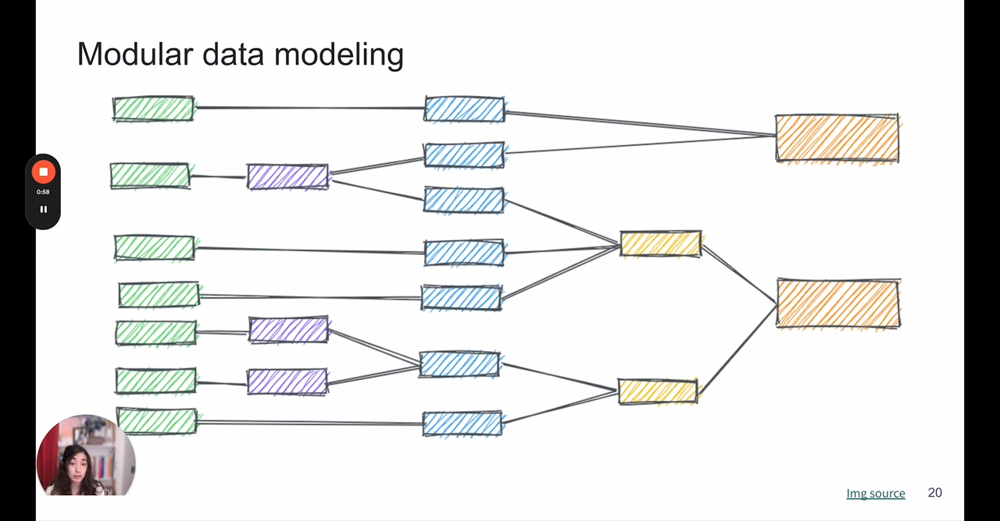
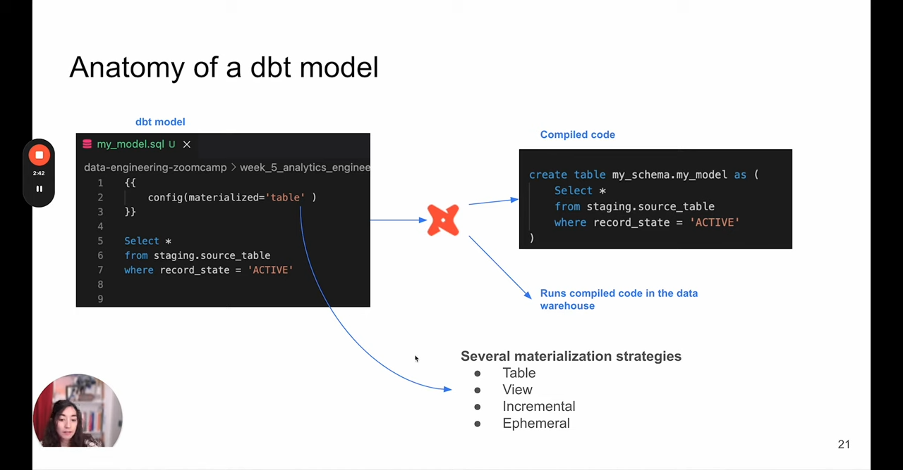
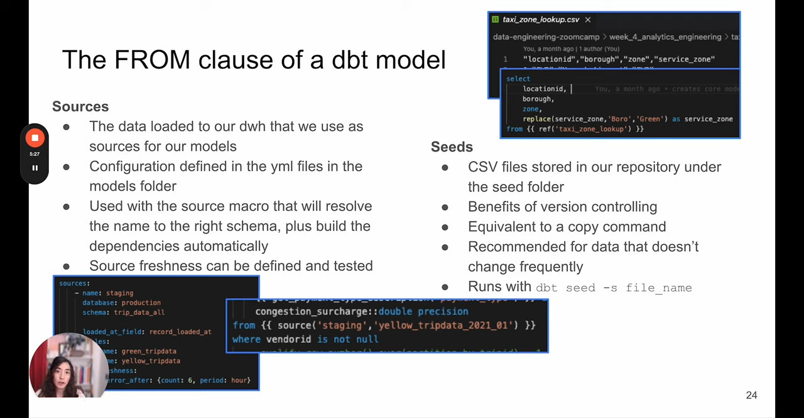
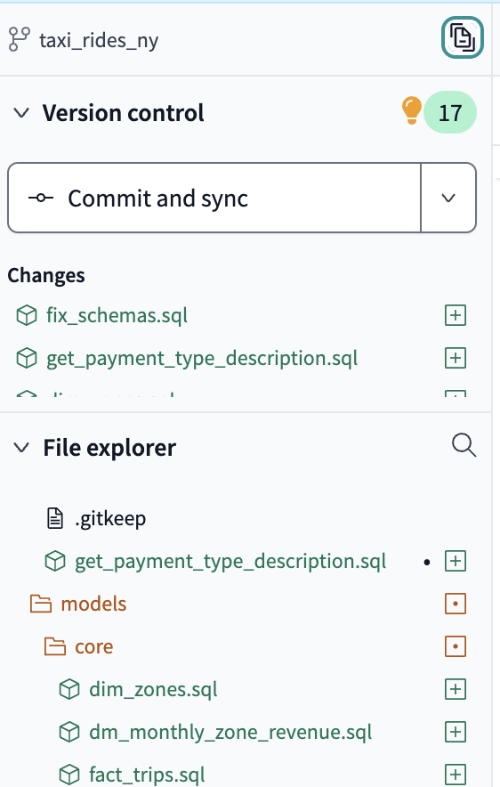
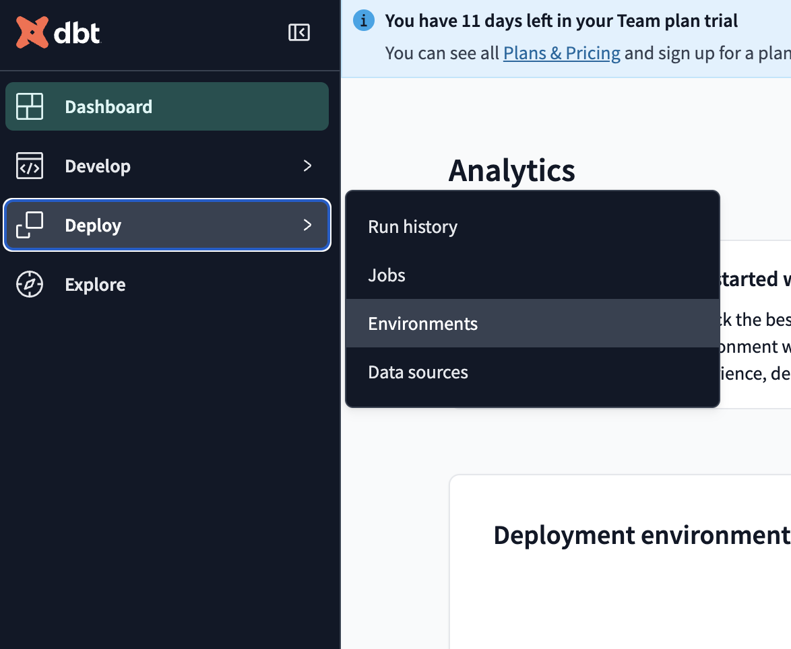
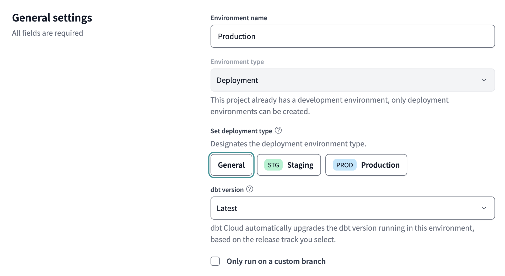
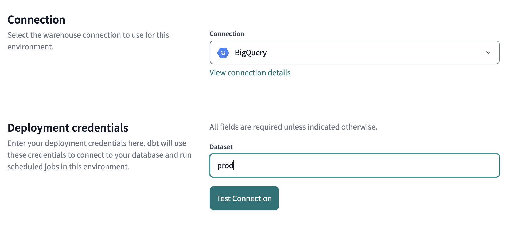
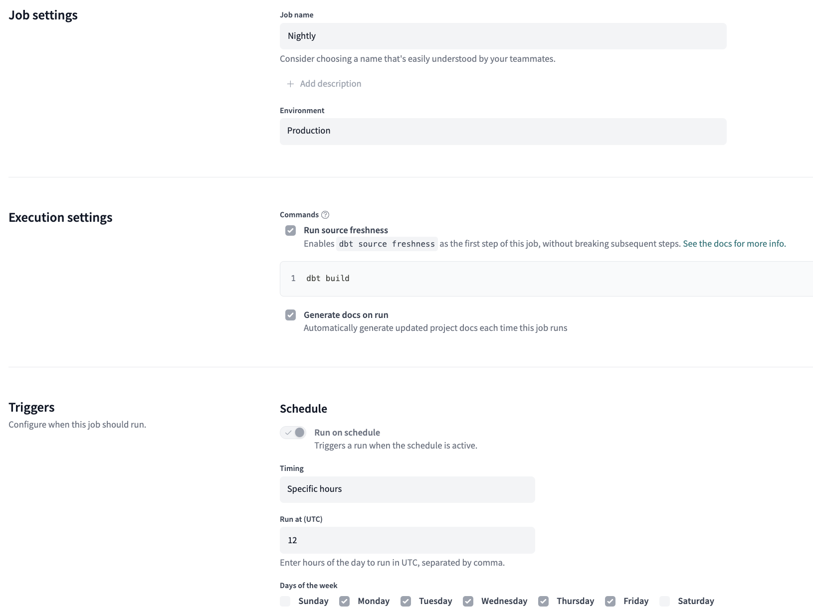

# Create dbt project

[Video](https://www.youtube.com/watch?v=1HmL63e-vRs&list=PL3MmuxUbc_hJed7dXYoJw8DoCuVHhGEQb&index=36) | [Setup](https://github.com/DataTalksClub/data-engineering-zoomcamp/tree/main/04-analytics-engineering#setting-up-your-environment)

- [Create dbt project](#create-dbt-project)
  - [Prerequisites](#prerequisites)
    - [Use Terrafrom](#use-terrafrom)
    - [Fix Schema issues](#fix-schema-issues)
    - [Upload data to GCS](#upload-data-to-gcs)
    - [Define Tables in BigQuery](#define-tables-in-bigquery)
    - [Run local dbt](#run-local-dbt)
  - [Important concepts](#important-concepts)
    - [Anatomy of a dbt model](#anatomy-of-a-dbt-model)
    - [Sources and Seeds](#sources-and-seeds)
    - [Macros](#macros)
    - [dbt packages](#dbt-packages)
    - [variables](#variables)
    - [Automated model yaml generation](#automated-model-yaml-generation)
    - [Testing](#testing)
    - [Documentation](#documentation)
    - [Deployment (Cloud)](#deployment-cloud)


## Prerequisites
To follow this guide, we need to have the following set up:

- A running warehouse (**BigQuery** or postgres)
- A set of running pipelines ingesting the project dataset (week 3 completed)
- The following datasets ingested from the course Datasets list:
  - Yellow taxi data - Years 2019 and 2020
  - Green taxi data - Years 2019 and 2020
  - fhv data - Year 2019.


First I create a new project in Google Cloud:

```bash
gcloud config set project dbt-demo-451819
```

Then I create a new dataset in BigQuery:

```bash
bq mk --dataset trips_data_all

```

Next, I follow the ideas outline in the 
[Video Hack for loading data to BigQuery for Week 4](https://youtu.be/Mork172sK_c?si=JKHuGwuh8g7_RVCu). Apparently, the NYC Taxi data is already available in BigQuery as `bigquery-public-data.new_york_taxi_trips`.

Thus we can prepare tables for the warehouse in bigquery using the following SQL queries:

```sql
CREATE OR REPLACE TABLE `trips_data_all.yellow_tripdata` AS
SELECT * FROM `bigquery-public-data.new_york_taxi_trips.yellow_taxi_trips_2019`
UNION ALL
SELECT * FROM `bigquery-public-data.new_york_taxi_trips.yellow_taxi_trips_2020`;

CREATE OR REPLACE TABLE `trips_data_all.green_tripdata` AS
SELECT * FROM `bigquery-public-data.new_york_taxi_trips.green_taxi_trips_2019`
UNION ALL
SELECT * FROM `bigquery-public-data.new_york_taxi_trips.green_taxi_trips_2020`;

```


The fhv data is not available in BigQuery, so we need to upload it using the web_to_gcs.py script from the [week 3 repo extras](https://github.com/DataTalksClub/data-engineering-zoomcamp/tree/main/03-data-warehouse/extras).

After adding my GCS bucket to the `web_to_gcs.py` script and adjusting it to only fetch the fhv data, I run the following command to upload the data to GCS:

```bash
python web_to_gcs.py 
```


In bigquery, I create a new table named `fhv_tripdata` in the  `trips_data_all`  dataset using the following SQL query:

```sql
-- Create external table referring to gcs path
-- use PARQUET format (https://cloud.google.com/bigquery/docs/loading-data-cloud-storage-parquet?hl=de)
CREATE OR REPLACE EXTERNAL TABLE `trips_data_all.fhv_tripdata`
OPTIONS (
  format = 'PARQUET',
  uris = ['https://storage.cloud.google.com/dezoomcamp-dbt--451819-bucket/fhv/fhv_tripdata_2019-*.parquet']
);
```


Apparently we need to fix some schema issues in the tables. I do this by running the following SQL query in bigquery:
> NOTE: This did not work out of the box. I had to move the data from a eu to us bucket. 

```sql
-- Create external table referring to gcs path
-- use PARQUET format (https://cloud.google.com/bigquery/docs/loading-data-cloud-storage-parquet?hl=de)
CREATE OR REPLACE EXTERNAL TABLE `trips_data_all.fhv_tripdata`
OPTIONS (
  format = 'PARQUET',
  uris = ['https://storage.cloud.google.com/dezoomcamp-dbt--451819-bucket/fhv/fhv_tripdata_2019-*.parquet']
);
```


```sql
 -- Fixes yellow table schema
ALTER TABLE `trips_data_all.yellow_tripdata`
  RENAME COLUMN vendor_id TO VendorID;
ALTER TABLE `trips_data_all.yellow_tripdata`
  RENAME COLUMN pickup_datetime TO tpep_pickup_datetime;
ALTER TABLE `trips_data_all.yellow_tripdata`
  RENAME COLUMN dropoff_datetime TO tpep_dropoff_datetime;
ALTER TABLE `trips_data_all.yellow_tripdata`
  RENAME COLUMN rate_code TO RatecodeID;
ALTER TABLE `trips_data_all.yellow_tripdata`
  RENAME COLUMN imp_surcharge TO improvement_surcharge;
ALTER TABLE `trips_data_all.yellow_tripdata`
  RENAME COLUMN pickup_location_id TO PULocationID;
ALTER TABLE `trips_data_all.yellow_tripdata`
  RENAME COLUMN dropoff_location_id TO DOLocationID;


  -- Fixes green table schema
ALTER TABLE `trips_data_all.green_tripdata`
  RENAME COLUMN vendor_id TO VendorID;
ALTER TABLE `trips_data_all.green_tripdata`
  RENAME COLUMN pickup_datetime TO lpep_pickup_datetime;
ALTER TABLE `trips_data_all.green_tripdata`
  RENAME COLUMN dropoff_datetime TO lpep_dropoff_datetime;
ALTER TABLE `trips_data_all.green_tripdata`
  RENAME COLUMN rate_code TO RatecodeID;
ALTER TABLE `trips_data_all.green_tripdata`
  RENAME COLUMN imp_surcharge TO improvement_surcharge;
ALTER TABLE `trips_data_all.green_tripdata`
  RENAME COLUMN pickup_location_id TO PULocationID;
ALTER TABLE `trips_data_all.green_tripdata`
  RENAME COLUMN dropoff_location_id TO DOLocationID;


 -- Fixes fhv table schema
ALTER TABLE `trips_data_all.fhv_tripdata`
  RENAME COLUMN vendor_id TO VendorID;
ALTER TABLE `trips_data_all.fhv_tripdata`
  RENAME COLUMN pickup_datetime TO lpep_pickup_datetime;
ALTER TABLE `trips_data_all.fhv_tripdata`
  RENAME COLUMN dropoff_datetime TO lpep_dropoff_datetime;
ALTER TABLE `trips_data_all.fhv_tripdata`
  RENAME COLUMN rate_code TO RatecodeID;
ALTER TABLE `trips_data_all.fhv_tripdata`
  RENAME COLUMN imp_surcharge TO improvement_surcharge;
ALTER TABLE `trips_data_all.fhv_tripdata`
  RENAME COLUMN pickup_location_id TO PULocationID;
ALTER TABLE `trips_data_all.fhv_tripdata`
  RENAME COLUMN dropoff_location_id TO DOLocationID;
```


> IMPORTANT: This did not work out in the end. I had to switch to using the taxi data provided at github.

### Use Terrafrom

Instead of using the public bigquery data, we can rather use terraform to set things up. We create a GCS bucket and upload the data there using the `web_to_gcs.py` script.


```sh
terraform -chdir=terraform/ init
terraform -chdir=terraform/ plan
terraform -chdir=terraform/ apply
```

### Fix Schema issues

As mentioned above, we need to fix the schema issues in the tables. The `web_to_gcs.py` has been adjusted to fix the schema issues encountered above. We introduce the `fix_types` function to cast columns to the correct data type.

```python
def fix_types(df):
    # cast time data to timestamp
    for column in df.filter(regex='datetime').columns:
        df[column] = pd.to_datetime(df[column])
    # also cast IDs and types to integer
    for column in df.filter(regex='ID|type').columns:
        df[column] = df[column].astype('int') 
    return df
```


However, when running the `web_to_gcs.py` script, we get the following error on the green data for 07-2019: 

```sh
Local: green_tripdata_2019-07.csv.gz
/Users/agosdsc/Library/CloudStorage/OneDrive-Personal/Courses/2025_data_engineering_zoomcamp/04_analytics_engineering/web_to_gcs.py:61: DtypeWarning: Columns (3) have mixed types. Specify dtype option on import or set low_memory=False.
  df = pd.read_csv(file_name, compression='gzip')
Traceback (most recent call last):
  File "/Users/agosdsc/Library/CloudStorage/OneDrive-Personal/Courses/2025_data_engineering_zoomcamp/04_analytics_engineering/web_to_gcs.py", line 79, in <module>
    web_to_gcs('2019', 'green')
    ~~~~~~~~~~^^^^^^^^^^^^^^^^^
  File "/Users/agosdsc/Library/CloudStorage/OneDrive-Personal/Courses/2025_data_engineering_zoomcamp/04_analytics_engineering/web_to_gcs.py", line 63, in web_to_gcs
    df = fix_types(df)
  File "/Users/agosdsc/Library/CloudStorage/OneDrive-Personal/Courses/2025_data_engineering_zoomcamp/04_analytics_engineering/web_to_gcs.py", line 41, in fix_types
    df[column] = df[column].astype('int')
                 ~~~~~~~~~~~~~~~~~^^^^^^^
  File "/Users/agosdsc/micromamba/envs/04_analytics_engineering/lib/python3.13/site-packages/pandas/core/generic.py", line 6643, in astype
    new_data = self._mgr.astype(dtype=dtype, copy=copy, errors=errors)
  File "/Users/agosdsc/micromamba/envs/04_analytics_engineering/lib/python3.13/site-packages/pandas/core/internals/managers.py", line 430, in astype
    return self.apply(
           ~~~~~~~~~~^
        "astype",
        ^^^^^^^^^
    ...<3 lines>...
        using_cow=using_copy_on_write(),
        ^^^^^^^^^^^^^^^^^^^^^^^^^^^^^^^^
    )
    ^
  File "/Users/agosdsc/micromamba/envs/04_analytics_engineering/lib/python3.13/site-packages/pandas/core/internals/managers.py", line 363, in apply
    applied = getattr(b, f)(**kwargs)
  File "/Users/agosdsc/micromamba/envs/04_analytics_engineering/lib/python3.13/site-packages/pandas/core/internals/blocks.py", line 758, in astype
    new_values = astype_array_safe(values, dtype, copy=copy, errors=errors)
  File "/Users/agosdsc/micromamba/envs/04_analytics_engineering/lib/python3.13/site-packages/pandas/core/dtypes/astype.py", line 237, in astype_array_safe
    new_values = astype_array(values, dtype, copy=copy)
  File "/Users/agosdsc/micromamba/envs/04_analytics_engineering/lib/python3.13/site-packages/pandas/core/dtypes/astype.py", line 182, in astype_array
    values = _astype_nansafe(values, dtype, copy=copy)
  File "/Users/agosdsc/micromamba/envs/04_analytics_engineering/lib/python3.13/site-packages/pandas/core/dtypes/astype.py", line 101, in _astype_nansafe
    return _astype_float_to_int_nansafe(arr, dtype, copy)
  File "/Users/agosdsc/micromamba/envs/04_analytics_engineering/lib/python3.13/site-packages/pandas/core/dtypes/astype.py", line 145, in _astype_float_to_int_nansafe
    raise IntCastingNaNError(
        "Cannot convert non-finite values (NA or inf) to integer"
    )
pandas.errors.IntCastingNaNError: Cannot convert non-finite values (NA or inf) to integer
```

To fix this error we need to cast to 'Int64' instead of 'int' in the `fix_types` function.


### Upload data to GCS

```sh
# test with green data
GCP_GCS_BUCKET="dezoomcamp-dbt--451819-bucket" YEAR="2019" SERVICE="green" python web_to_gcs.py
```

```sh
# run for all data
GCP_GCS_BUCKET="dezoomcamp-dbt--451819-bucket" python web_to_gcs.py
```

### Define Tables in BigQuery

In bigquery, I create a new table for each service in the  `trips_data_all`  dataset using the following SQL queries:


```sql
-- Create external table referring to gcs path
-- use PARQUET format (https://cloud.google.com/bigquery/docs/loading-data-cloud-storage-parquet?hl=de)
CREATE OR REPLACE EXTERNAL TABLE `trips_data_all.green_tripdata`
OPTIONS (
  format = 'PARQUET',
  uris = ['https://storage.cloud.google.com/dezoomcamp-dbt--451819-bucket/green/green_tripdata_2019-*.parquet']
);

-- Create external table referring to gcs path
-- use PARQUET format (https://cloud.google.com/bigquery/docs/loading-data-cloud-storage-parquet?hl=de)
CREATE OR REPLACE EXTERNAL TABLE `trips_data_all.yellow_tripdata`
OPTIONS (
  format = 'PARQUET',
  uris = ['https://storage.cloud.google.com/dezoomcamp-dbt--451819-bucket/yellow/yellow_tripdata_2019-*.parquet']
);

-- Create external table referring to gcs path
-- use PARQUET format (https://cloud.google.com/bigquery/docs/loading-data-cloud-storage-parquet?hl=de)
CREATE OR REPLACE EXTERNAL TABLE `trips_data_all.fhv_tripdata`
OPTIONS (
  format = 'PARQUET',
  uris = ['https://storage.cloud.google.com/dezoomcamp-dbt--451819-bucket/fhv/fhv_tripdata_2019-*.parquet']
);
```

> NOTE: This step can be skipped if we define the external tables in the `models/staging/schema.yml` file.

### Run local dbt

Set up a dbt profile for bigquery that specifies the project and dataset in [dbt/profiles.yml](./dbt/profiles.yml). Use method `oauth` to authenticate with a service account.

```sh
 gcloud auth application-default login
```

Copy the Dockerfile from github:

```
wget https://raw.githubusercontent.com/DataTalksClub/data-engineering-zoomcamp/refs/heads/main/04-analytics-engineering/docker_setup/Dockerfile
```

Create a [docker compose file](./docker-compose.yaml) that mounts the local folder and the dbt profile file.

Build the dbt image:
```sh
docker compose build 
```
Initialize dbt:
```sh
docker compose run dbt-bq-dtc init
```

docker compose run --workdir="//usr/app/dbt/taxi_rides_ny" dbt-bq-dtc debug


## Important concepts

### Anatomy of a dbt model

[Video Chapter](https://www.youtube.com/watch?v=ueVy2N54lyc&list=PL3MmuxUbc_hJed7dXYoJw8DoCuVHhGEQb&index=37&t=0s)


We start from our **sources** and build **models** in dbt to perfrom **transformations** on the data.

We go from a dbt **model** to compiled **SQL code** which is run in the database.



### Sources and Seeds

[Video chapter](https://youtu.be/ueVy2N54lyc?t=195&si=S4YSknkSuAelheBU)

**Sources** are tables that we can use in our models. We define them in a `schema.yml` file, such that we can reference them in our models. We can use them in our models by using the `source` function.

Source definitions look like this:
```yml
version: 2

sources:
  - name: staging
    database: "{{ env_var('DBT_DATABASE', 'dbt-demo-451819') }}"
    schema: "{{ env_var('DBT_SCHEMA', 'trips_data_all') }}"
      # loaded_at_field: record_loaded_at
    tables:
      - name: green_tripdata
      - name: yellow_tripdata
         # freshness:
           # error_after: {count: 6, period: hour}
```

A model definition looks like this:
```sql
{{
    config(
        materialized='view'
    )
}}

with tripdata as 
(
  select *,
    row_number() over(partition by vendorid, lpep_pickup_datetime) as rn
  from {{ source('staging','green_tripdata') }}
  where vendorid is not null 
)
```

This model is compiled to the following SQL code:
```sql
 create or replace view `dbt-demo-451819`.`dbt_ablume`.`stg_green_tripdata`
  OPTIONS()
  as 

with tripdata as 
(
  select *,
    row_number() over(partition by vendorid, lpep_pickup_datetime) as rn
  from `dbt-demo-451819`.`trips_data_all`.`green_tripdata`
  where vendorid is not null 
)
```


**Seeds** are static data that we can use in our models. We add them to our repository as csv files. We can use them in our models by using the `ref` function.



### Macros

**Macros** are reusable pieces of code that we can use in our models. They use jinja syntax.

This is an example of a macro:
```jinja
{#
    This macro returns the description of the payment_type 
#}



    case {{ dbt.safe_cast("payment_type", api.Column.translate_type("integer")) }}  
        when 1 then 'Credit card'
        when 2 then 'Cash'
        when 3 then 'No charge'
        when 4 then 'Dispute'
        when 5 then 'Unknown'
        when 6 then 'Voided trip'
        else 'EMPTY'
    end


```

They can be used in models like this:

```sql

select
    {{ get_payment_type_description('payment_type') }} as payment_type_description
    from tripdata
```

Which would compile to:
```sql
select
    case safe_cast(payment_type as INT64) 
        when 1 then 'Credit card' 
        when 2 then 'Cash'
        when 3 then 'No charge'
        when 4 then 'Dispute' 
        when 5 then 'Unknown'
        when 6 then 'Voided trip'
        else 'EMPTY'
    end as payment_type_description
    from tripdata
```

### dbt packages

dbt pacckages are a way to share models, macros, and other dbt artifacts with other dbt users. They are published to the [dbt hub](https://hub.getdbt.com/).

### variables

Variables are a way to define values to use accross a dbt project. The can be define locally in models or globally in the `dbt_project.yml` file. You can use them in your models by using the `var` function, or in the command line by using the `--vars` flag.

An example of a variable defined in a model is:
```sql
-- dbt build --select <model_name> --vars '{'is_test_run': 'false'}'


  limit 100


```
This variable is used to limit the number of rows returned in a test run. It is true by default, but can be set to false in the command line by using the `--vars` flag. 


> Important: The number of rows added to the staging tables is limited to 100 rows. This is done to prevent the staging tables from growing too large.
> To disable this and run for all data, run the following command:
> -- dbt build --select <model_name> --vars '{'is_test_run': 'false'}'

### Automated model yaml generation

We can use the [codegen](https://github.com/dbt-labs/dbt-codegen?tab=readme-ov-file#generate_model_yaml-source) package to generate yaml files for our models. This is done by running the `generate_model_yaml`  command ([docs)](https://github.com/dbt-labs/dbt-codegen?tab=readme-ov-file#generate_model_yaml-source)).

We copy this macro into to dbt IDE and compile it as selection.

```sql

{{ codegen.generate_model_yaml(
    model_names = models_to_generate
) }}
```

This will generate the yaml code for the models properties:

```yaml
version: 2

models:
  - name: stg_green_tripdata
    description: ""
    columns:
      - name: tripid
        data_type: string
        description: ""

      - name: vendorid
        data_type: int64
        description: ""

      - name: ratecodeid
        data_type: int64
        description: ""
[...]
```

Alternatively, we can use the cli command:
```bash
$ dbt run-operation generate_model_yaml --args '{"model_names": ["customers"]}'
```


### Testing

[Video](https://youtu.be/2dNJXHFCHaY?si=IzcjHrQ3at5PSqZH)

Tests are a way to ensure that the data in your models is correct. They are defined in the `schemas.yml` for the models. 

We can test the validity of the tripidd column:
```yaml
[...]
models:
    - name: stg_green_tripdata
      columns:
          - name: tripid
            tests:
                - unique:
                    severity: warn
                - not_null:
                    severity: warn
```

We could test for relationships between tables:
```yaml
[...]
models:
[...]
          - name: Pickup_locationid
            description: locationid where the meter was engaged.
            tests:
              - relationships:
                  to: ref('taxi_zone_lookup')
                  field: locationid
                  severity: warn
```

We also want to check the validity of the payment_type column:
```yaml
[...]
      - name: Payment_type 
            tests: 
              - accepted_values:
                  values: 
                  - [1, 2, 3, 4, 5]
                  severity: warn
```

If we define the payment type values in the global variables, we can use them in our tests. Because of Biqqueryy's lack of support for arrays, we need to use the `quote` parameter to disable the quoting of the values.
```yaml
[...]
    - name: Payment_type 
            tests: 
              - accepted_values:
                  values: "{{ var('payment_type_values') }}"
                  severity: warn
                  quote: false
```

### Documentation

Every object in dbt can be documented. This is done by adding a `description` property to the object.

In the IDE, there is a button in the top right of the side panel to view documentation for the project.


### Deployment (Cloud)

We create a new environment `Production` in the dbt Cloud UI, use the connection to the BigQuery project, and deploy under `prod`.




Then we create a new job to deploy the project to the `Production` environment. We can trigger this job based on a schedule,  manually or via an API.
