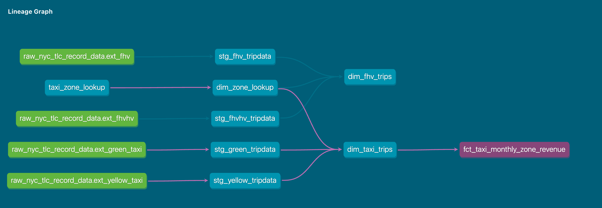

## Module 4 Homework

For this homework, you will need the following datasets:
* [Green Taxi dataset (2019 and 2020)](https://github.com/DataTalksClub/nyc-tlc-data/releases/tag/green)
* [Yellow Taxi dataset (2019 and 2020)](https://github.com/DataTalksClub/nyc-tlc-data/releases/tag/yellow)
* [For Hire Vehicle dataset (2019)](https://github.com/DataTalksClub/nyc-tlc-data/releases/tag/fhv)

### Before you start

1. Make sure you, **at least**, have them in GCS with a External Table **OR** a Native Table - use whichever method you prefer to accomplish that (Workflow Orchestration with [pandas-gbq](https://cloud.google.com/bigquery/docs/samples/bigquery-pandas-gbq-to-gbq-simple), [dlt for gcs](https://dlthub.com/docs/dlt-ecosystem/destinations/filesystem), [dlt for BigQuery](https://dlthub.com/docs/dlt-ecosystem/destinations/bigquery), [gsutil](https://cloud.google.com/storage/docs/gsutil), etc)
2. You should have exactly `7,778,101` records in your Green Taxi table
3. You should have exactly `109,047,518` records in your Yellow Taxi table
4. You should have exactly `43,244,696` records in your FHV table
5. Build the staging models for green/yellow as shown in [here](../../../04-analytics-engineering/taxi_rides_ny/models/staging/)
6. Build the dimension/fact for taxi_trips joining with `dim_zones`  as shown in [here](../../../04-analytics-engineering/taxi_rides_ny/models/core/fact_trips.sql)

**Note**: If you don't have access to GCP, you can spin up a local Postgres instance and ingest the datasets above

#### Solution

Setup of the environment is described 

### Question 1: Understanding dbt model resolution

Provided you've got the following sources.yaml
```yaml
version: 2

sources:
  - name: raw_nyc_tripdata
    database: "{{ env_var('DBT_BIGQUERY_PROJECT', 'dtc_zoomcamp_2025') }}"
    schema:   "{{ env_var('DBT_BIGQUERY_SOURCE_DATASET', 'raw_nyc_tripdata') }}"
    tables:
      - name: ext_green_taxi
      - name: ext_yellow_taxi
```

with the following env variables setup where `dbt` runs:
```shell
export DBT_BIGQUERY_PROJECT=myproject
export DBT_BIGQUERY_DATASET=my_nyc_tripdata
```

What does this .sql model compile to?
```sql
select * 
from {{ source('raw_nyc_tripdata', 'ext_green_taxi' ) }}
```

- `select * from dtc_zoomcamp_2025.raw_nyc_tripdata.ext_green_taxi`
- `select * from dtc_zoomcamp_2025.my_nyc_tripdata.ext_green_taxi`
- **`select * from myproject.raw_nyc_tripdata.ext_green_taxi`**  <<--
- `select * from myproject.my_nyc_tripdata.ext_green_taxi`
- `select * from dtc_zoomcamp_2025.raw_nyc_tripdata.green_taxi`

#### Solution

The environment variables will be picked up when compiling the model, but only the first part (only `DBT_BIGQUERY_PROJECT`) will be expanded. The variable `DBT_BIGQUERY_DATASET` will be ignored since it is not referenced in the source definition, thus the default value of `DBT_BIGQUERY_SOURCE_DATASET` will be used. The correct table name will be `myproject.raw_nyc_tripdata.ext_green_taxi`.

### Question 2: dbt Variables & Dynamic Models

Say you have to modify the following dbt_model (`fct_recent_taxi_trips.sql`) to enable Analytics Engineers to dynamically control the date range. 

- In development, you want to process only **the last 7 days of trips**
- In production, you need to process **the last 30 days** for analytics

```sql
select *
from {{ ref('fact_taxi_trips') }}
where pickup_datetime >= CURRENT_DATE - INTERVAL '30' DAY
```

What would you change to accomplish that in a such way that command line arguments takes precedence over ENV_VARs, which takes precedence over DEFAULT value?

- Add `ORDER BY pickup_datetime DESC` and `LIMIT {{ var("days_back", 30) }}`
- Update the WHERE clause to `pickup_datetime >= CURRENT_DATE - INTERVAL '{{ var("days_back", 30) }}' DAY`
- Update the WHERE clause to `pickup_datetime >= CURRENT_DATE - INTERVAL '{{ env_var("DAYS_BACK", "30") }}' DAY`
- **Update the WHERE clause to `pickup_datetime >= CURRENT_DATE - INTERVAL '{{ var("days_back", env_var("DAYS_BACK", "30")) }}' DAY`** <<-- 
- Update the WHERE clause to `pickup_datetime >= CURRENT_DATE - INTERVAL '{{ env_var("DAYS_BACK", var("days_back", "30")) }}' DAY`


#### Solution

To achieve a precedence of **cli-argument > env-var > default**, you last use the `var` function. The `env_var` function will be evaluated first and has a default value of `"30"`. 
If **no cli-argument** is given and **no env-var** is provided, the **default value** will be used. If **no cli-argument** is given but the **env-var is set**, the **env-var** will be used. If a **cli-argument** is given, the **cli-argument** will be used.

### Question 3: dbt Data Lineage and Execution

Considering the data lineage below **and** that taxi_zone_lookup is the **only** materialization build (from a .csv seed file):



Select the option that does **NOT** apply for materializing `fct_taxi_monthly_zone_revenue`:

- `dbt run`
- `dbt run --select +models/core/dim_taxi_trips.sql+ --target prod`
- `dbt run --select +models/core/fct_taxi_monthly_zone_revenue.sql`
- `dbt run --select +models/core/`
- **`dbt run --select models/staging/+`** <<-- 

#### Solution

The correct answer should be the last option (5): `dbt run --select models/staging/+`. 
All other options will either build the complete project (1), or build all components in the   `core` folder (2,3,4). 
The fifth option will only build the models in the `staging` folder as they are not dependent on any other models.


### Question 4: dbt Macros and Jinja

Consider you're dealing with sensitive data (e.g.: [PII](https://en.wikipedia.org/wiki/Personal_data)), that is **only available to your team and very selected few individuals**, in the `raw layer` of your DWH (e.g: a specific BigQuery dataset or PostgreSQL schema), 

 - Among other things, you decide to obfuscate/masquerade that data through your staging models, and make it available in a different schema (a `staging layer`) for other Data/Analytics Engineers to explore

- And **optionally**, yet  another layer (`service layer`), where you'll build your dimension (`dim_`) and fact (`fct_`) tables (assuming the [Star Schema dimensional modeling](https://www.databricks.com/glossary/star-schema)) for Dashboarding and for Tech Product Owners/Managers

You decide to make a macro to wrap a logic around it:

```sql


    
    

     {{- env_var(target_env_var) -}}
                        {{- env_var(stging_env_var, env_var(target_env_var)) -}}
    


```

And use on your staging, dim_ and fact_ models as:
```sql
{{ config(
    schema=resolve_schema_for('core'), 
) }}
```

That all being said, regarding macro above, **select all statements that are true to the models using it**:
- **Setting a value for  `DBT_BIGQUERY_TARGET_DATASET` env var is mandatory, or it'll fail to compile**
- ~~Setting a value for `DBT_BIGQUERY_STAGING_DATASET` env var is mandatory, or it'll fail to compile~~
- **When using `core`, it materializes in the dataset defined in `DBT_BIGQUERY_TARGET_DATASET`**
- **When using `stg`, it materializes in the dataset defined in `DBT_BIGQUERY_STAGING_DATASET`, or defaults to `DBT_BIGQUERY_TARGET_DATASET`**
- **When using `staging`, it materializes in the dataset defined in `DBT_BIGQUERY_STAGING_DATASET`, or defaults to `DBT_BIGQUERY_TARGET_DATASET`**


#### Solution

The only wrong answer is the second one. If `DBT_BIGQUERY_STAGING_DATASET` is not set, the macro will still compile, since we fall back to the `DBT_BIGQUERY_TARGET_DATASET` env var.

## Serious SQL

Alright, in module 1, you had a SQL refresher, so now let's build on top of that with some serious SQL.

These are not meant to be easy - but they'll boost your SQL and Analytics skills to the next level.  
So, without any further do, let's get started...

You might want to add some new dimensions `year` (e.g.: 2019, 2020), `quarter` (1, 2, 3, 4), `year_quarter` (e.g.: `2019/Q1`, `2019-Q2`), and `month` (e.g.: 1, 2, ..., 12), **extracted from pickup_datetime**, to your `fct_taxi_trips` OR `dim_taxi_trips.sql` models to facilitate filtering your queries


#### Solution

We can write a macro and use [extract function](https://docs.getdbt.com/blog/extract-sql-love-letter) to extract `year`, `quarter`, `year_quarter`, and `month` from `pickup_datetime`.

We create a new macro `extract_time_dimension` that returns the following columns:
```sql
   

    extract(year from {{ date_column }}) as year,
    extract(quarter from {{ date_column }}) as quarter,
    extract(year from {{ date_column }}) || '/Q' || extract(quarter from {{ date_column }}) as year_quarter,
    extract(month from {{ date_column }}) as month,


```


We update  the `fct_taxi_trips.sql` model to append the following columns when selecting from `trips_unioned` :

```sql
select 
[...]
	trips_unioned.payment_type_description,
	{{ extract_time_dimension("trips_unioned.pickup_datetime") }} -- use the new macro
    from trips_unioned
    [...]
```


### Question 5: Taxi Quarterly Revenue Growth

1. Create a new model `fct_taxi_trips_quarterly_revenue.sql`
2. Compute the Quarterly Revenues for each year for based on `total_amount`
3. Compute the Quarterly YoY (Year-over-Year) revenue growth 
  * e.g.: In 2020/Q1, Green Taxi had -12.34% revenue growth compared to 2019/Q1
  * e.g.: In 2020/Q4, Yellow Taxi had +34.56% revenue growth compared to 2019/Q4

Considering the YoY Growth in 2020, which were the yearly quarters with the best (or less worse) and worst results for green, and yellow

- green: {best: 2020/Q2, worst: 2020/Q1}, yellow: {best: 2020/Q2, worst: 2020/Q1}
- green: {best: 2020/Q2, worst: 2020/Q1}, yellow: {best: 2020/Q3, worst: 2020/Q4}
- green: {best: 2020/Q1, worst: 2020/Q2}, yellow: {best: 2020/Q2, worst: 2020/Q1}
- **green: {best: 2020/Q1, worst: 2020/Q2}, yellow: {best: 2020/Q1, worst: 2020/Q2}** <<-- 
- green: {best: 2020/Q1, worst: 2020/Q2}, yellow: {best: 2020/Q3, worst: 2020/Q4}

#### Solution

To calculate the yoy growth, we can write this query:

```sql
-- Compute the Quarterly Revenues for each year for based on `total_amount`
-- Compute the Quarterly YoY (Year-over-Year) revenue growth 
with trips_data as (
    select * from `dbt-demo-451819.dbt_ablume.fact_trips`
)
    select 
    -- Revenue grouping 
    year_quarter as revenue_quarter,

    service_type, 
    -- Revenue calculation 
    sum(total_amount) as revenue_quarterly_total_amount,
    -- lag(year_quarter, 8) over (order by year_quarter, service_type) as last_year_same_quarter, 
    -- lag(service_type, 8) over (order by year_quarter, service_type) as last_year_same_quarter_type, 
    lag(sum(total_amount), 8) over (order by year_quarter, service_type) as revenue_last_year_same_quarter, 
    100 * (sum(total_amount) / nullif(lag(sum(total_amount), 8) over (order by year_quarter), 0) - 1 ) as yoy_revenue_growth,

    from trips_data
    where year in (2019,2020)
    group by revenue_quarter,service_type
    ORDER BY revenue_quarter,service_type DESC

```

YOY growth results:

| revenue_quarter | service_type | revenue_quarterly_total_amount | revenue_last_year_same_quarter | yoy_revenue_growth | best | worst |
| --- | --- | --- | --- | --- | --- | --- |
| 2019/Q1 | Yellow | 186774928.52 |  |  | |  | 
| 2019/Q1 | Green | 28923911.8 |  |  | |  |
| 2019/Q2 | Yellow | 204185297.38 |  |  |   |  |
| 2019/Q2 | Green | 23903138.63 |  |  |   |  |
| 2019/Q3 | Yellow | 190600121.27 |  |  | |  |
| 2019/Q3 | Green | 20074203.17 |  |  | |  |
| 2019/Q4 | Yellow | 195441626.53 |  |  | |  |
| 2019/Q4 | Green | 18493342.22 |  |  | |  |
| 2020/Q1 | Yellow | 148379572.13 | 186774928.52 | -20.5570184 | x |  | 
| 2020/Q1 | Green | 13693799.06 | 28923911.8 | -52.6557848 | x |  | 
| 2020/Q2 | Yellow | 18399392.84 | 204185297.38 | -90.9888748 | | x | 
| 2020/Q2 | Green | 2761935.64 | 23903138.63 | -88.4453013 | |  x| 
| 2020/Q3 | Yellow | 46005726.92 | 190600121.27 | -75.862698 | |  | 
| 2020/Q3 | Green | 4326703.35 | 20074203.17 | -78.4464503 | |  | 
| 2020/Q4 | Yellow | 62204346.4 | 195441626.53 | -68.1724167 | |  | 
| 2020/Q4 | Green | 4326012.1 | 18493342.22 | -76.6077324 | |  | 


### Question 6: P97/P95/P90 Taxi Monthly Fare

1. Create a new model `fct_taxi_trips_monthly_fare_p95.sql`
2. Filter out invalid entries (`fare_amount > 0`, `trip_distance > 0`, and `payment_type_description in ('Cash', 'Credit Card')`)
3. Compute the **continous percentile** of `fare_amount` partitioning by service_type, year and and month

Now, what are the values of `p97`, `p95`, `p90` for Green Taxi and Yellow Taxi, in April 2020?

- green: {p97: 55.0, p95: 45.0, p90: 26.5}, yellow: {p97: 52.0, p95: 37.0, p90: 25.5}
- green: {p97: 55.0, p95: 45.0, p90: 26.5}, yellow: {p97: 31.5, p95: 25.5, p90: 19.0}
- green: {p97: 40.0, p95: 33.0, p90: 24.5}, yellow: {p97: 52.0, p95: 37.0, p90: 25.5}
- green: {p97: 40.0, p95: 33.0, p90: 24.5}, yellow: {p97: 31.5, p95: 25.5, p90: 19.0}
- green: {p97: 55.0, p95: 45.0, p90: 26.5}, yellow: {p97: 52.0, p95: 25.5, p90: 19.0}

#### Solution

**Big Issue**: Using the hack to load the datasets, the payment_type description is not loaded correctly. While the yellow dataset is correct, the green dataset cannot be resolved correctly. 
Yellow payment_types contain no floating point numbers, while green dataset payment types end in `.0`, e.g 1.0, 2.0 etc which cannot be safely casted to integer.

When inspecting the staging process I noticed that the payment type is not loaded correctly, it will `0` after the safe_cast, and the description will always be EMPTY. 

When trying to do a simple cast, I get the following error: `Bad int64 value: 1.0`

```sql
with tripdata as 
(
  select *,
    row_number() over(partition by vendorid, lpep_pickup_datetime) as rn
  from `dbt-demo-451819`.`trips_data_all`.`green_tripdata`
  where vendorid is not null 
  LIMIT 100
)
select
    payment_type,
    coalesce(safe_cast(payment_type as INT64),0) as payment_type,
    case cast(payment_type as INT64)  
        when 1 then 'Credit card'
        when 2 then 'Cash'
        when 3 then 'No charge'
        when 4 then 'Dispute'
        when 5 then 'Unknown'
        when 6 then 'Voided trip'
        else 'EMPTY'
    end as payment_type_description
from tripdata
where rn = 1

-- dbt build --select <model_name> --vars '{'is_test_run': 'false'}'
  limit 100
```

To solve this I ajusted the casting of payment type to numeric instead of integer.

This did resolve my initial issue, but the results do not match the expected results. This is probably due to the fact that I loaded the data from bigquery examples database and not from github.


### Question 7: Top #Nth longest P90 travel time Location for FHV

Prerequisites:
* Create a staging model for FHV Data (2019), and **DO NOT** add a deduplication step, just filter out the entries where `where dispatching_base_num is not null`
* Create a core model for FHV Data (`dim_fhv_trips.sql`) joining with `dim_zones`. Similar to what has been done [here](../../../04-analytics-engineering/taxi_rides_ny/models/core/fact_trips.sql)
* Add some new dimensions `year` (e.g.: 2019) and `month` (e.g.: 1, 2, ..., 12), based on `pickup_datetime`, to the core model to facilitate filtering for your queries

Now...
1. Create a new model `fct_fhv_monthly_zone_traveltime_p90.sql`
2. For each record in `dim_fhv_trips.sql`, compute the [timestamp_diff](https://cloud.google.com/bigquery/docs/reference/standard-sql/timestamp_functions#timestamp_diff) in seconds between dropoff_datetime and pickup_datetime - we'll call it `trip_duration` for this exercise
3. Compute the **continous** `p90` of `trip_duration` partitioning by year, month, pickup_location_id, and dropoff_location_id

For the Trips that **respectively** started from `Newark Airport`, `SoHo`, and `Yorkville East`, in November 2019, what are **dropoff_zones** with the 2nd longest p90 trip_duration ?

- LaGuardia Airport, Chinatown, Garment District
- LaGuardia Airport, Park Slope, Clinton East
- LaGuardia Airport, Saint Albans, Howard Beach
- LaGuardia Airport, Rosedale, Bath Beach
- LaGuardia Airport, Yorkville East, Greenpoint

#### Solution

I was able to create the model, but was not able to build the ``dim_fhv_trips.sql` due to issues with BigQuery. There were type missmatches when trying to build the model.

```sql
Error while reading table: dbt-demo-451819.trips_data_all.fhv_tripdata_dump, error message: Parquet column 'dropOff_datetime' has type BYTE_ARRAY which does not match the target cpp_type INT64. File: gs://dezoomcamp-dbt--451819-bucket/fhv/fhv_tripdata_2019-03.parquet
```

There were a [few solutions](https://datatalks-club.slack.com/archives/C01FABYF2RG/p1739725070024049) suggested.


I tried to adjust the schema in BigQuery to match the schema of the parquet files, but it did not work.

```
CREATE OR REPLACE EXTERNAL TABLE `trips_data_all.fhv_tripdata_dump` (
  dispatching_base_num STRING,
  pickup_datetime TIMESTAMP,
  dropoff_datetime TIMESTAMP,
  PUlocationID FLOAT64,
  DOlocationID FLOAT64,
  SR_Flag INT64,
  Affiliated_base_number STRING
)
OPTIONS (
  format = 'PARQUET',
  uris = ['gs://dbt-us-45819-bucket/fhv/fhv_tripdata_2019*.parquet']
);
```

Simple select statements to test the data failed as well.

```sql
SELECT * FROM `dbt-demo-451819.trips_data_all.fhv_tripdata_dump` LIMIT 100
> Error while reading table: dbt-demo-451819.trips_data_all.fhv_tripdata_dump, error message: Parquet column 'dropOff_datetime' has type BYTE_ARRAY which does not match the target cpp_type INT64. File: gs://dbt-us-45819-bucket/fhv/fhv_tripdata_2019-03.parquet
```


## Submitting the solutions

* Form for submitting: https://courses.datatalks.club/de-zoomcamp-2025/homework/hw4


## Solution 

* To be published after deadline